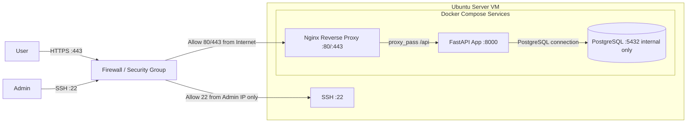

# Deployment Architecture

```mermaid
flowchart LR
    Admin[Admin]
    User[User]

    FW[Firewall / Security Group]

    subgraph VM[Ubuntu Server VM]
        SSH[SSH :22]

        subgraph Compose[Docker Compose Services]
            Nginx[Nginx Reverse Proxy :80/:443]
            App[FastAPI App :8000]
            DB[(PostgreSQL :5432 internal only)]
        end
    end

    User -->|HTTPS :443| FW
    Admin -->|SSH :22| FW

    FW -->|Allow 80/443 from Internet| Nginx
    FW -->|Allow 22 from Admin IP only| SSH

    Nginx -->|proxy_pass /api| App
    App -->|PostgreSQL connection| DB
```