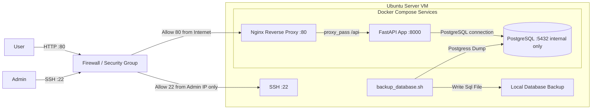
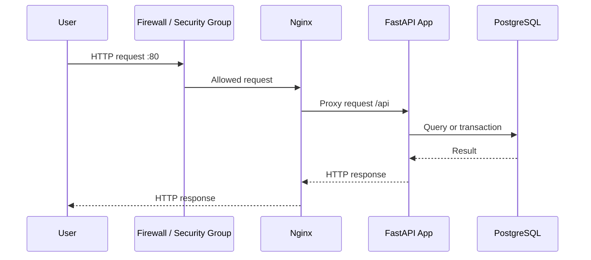
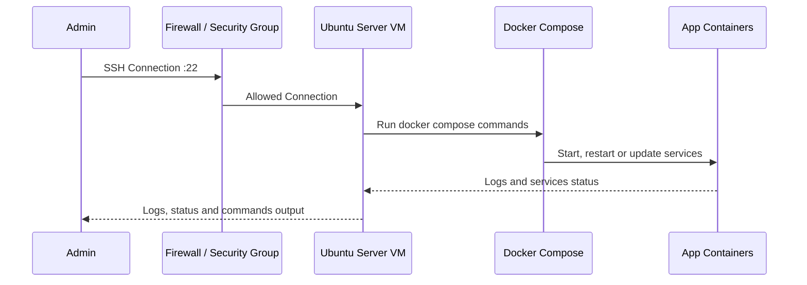

# System Architecture
## Mermaid Diagram

## Components

### User

Represents the final user who accesses the application.
The user does not access straight to the application, instead he access with the HTTP protocol through a reverse proxy.

### Admin

Represents the system administrator responsible for maintaining the server.
He can access the system through an SSH connection to make maintenance, changes, check logs or update services.

### Firewall / Security Group

Controls inbound network traffic to the system.
Allows HTTP traffic from internet and restricts the SSH access only to an admin or responsables of server ips.

### Ubuntu Server VM

Linux server where the main services run.
Acts as host for Docker and Docker Compose.

### Docker Compose

Orchestrates the application services into containers.
It will keep the reverse proxy, the backend application and the database up.

### Nginx Reverse Proxy

Receives the external HTTP requests and will redirect them to the FastAPI application

### FastAPI Backend

Contains the principal business logic.
Processes incoming requests. validates data and gets or modifies the PostgreSQL information.

### PostgreSQL Database

Relational database of the system.
Stores persistent application data, records, states, and operational data.

### Backup Database

Bash script running in the background on the Ubuntu Server to perform periodic local database backups.
The script will make a dump in a period of time defined by the admin and save it in the local server.

## User Flow
1. The user accesses the application through HTTP on port 80.
2. The request reaches the Firewall / Security Group.
3. The Firewall / Security Group allows inbound HTTP traffic on port 80.
4. Nginx receives the HTTP request.
5. Nginx forwards the request to the FastAPI backend using the configured reverse proxy rules.
6. The FastAPI backend processes the request.
7. If persistent data is required, the backend queries or updates the PostgreSQL database.
8. PostgreSQL returns the requested data or confirms the transaction.
9. The FastAPI backend returns an HTTP response to Nginx.
10. Nginx sends the final HTTP response back to the user.

## Administration Flow

1. The admin connects to the server through SSH on port 22.
2. The connection reaches the Firewall / Security Group.
3. The Firewall / Security Group allows the connection only if it is comming from an authorized IP and the port 22.
4. The admin once connected makes maintenance tasks, changes, checks logs and restart or update services.

