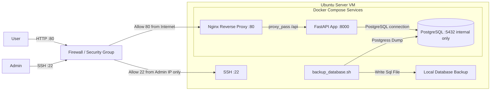
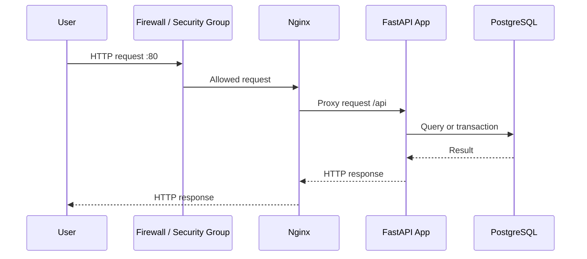

# System Architecture
## Mermaid Diagram

## Components

### User

Represents the final user that access the application.
The user does not access straight to the application, instead he access with the HTTP protocol through a reverse proxy.

### Admin

Represents the system administrator or the responsable of the server.
He can access the system through an SSH connection to make manteinance, changes, check logs or update services.

### Firewall / Security Group

Controls the entrance network traffic of the system.
Allows HTTP traffic from internet and restricts the SSH access only to an admin or responsables of server ips.

### Ubuntu Server VM

Linux server where all the principal services will be executing. 
Acts as host for Docker and Docker Compose.

### Docker Compose

Orchestrates the application services into containers.
It will keep the reverse proxy, the backend application and the database up.

### Nginx Reverse Proxy

Receives the external HTTP requests and will redirect them to the FastAPI application

### FastAPI Backend

Contains the principal business logic.
Process the entry requests, validates data and gets or modifies the PostgreSQL information.

### PostgreSQL Database

Relational database of the system.
Saves persistent user data, registers, states and operative data.

### Backup Database

Bash script running at the Ubuntu Server backround doing periodical local database backups.
The script will make a dump in a period of time defined by the admin and save it in the local server.

## User Flow
1. The user access the app through the HTTP protocol
2. The request pass through the firewall/security group
3. The firewall/security group allows the traffic for the port 80.
4. The Nginx receives the request
5. The Nginx Reverse Proxy redirects the traffic to the FastAPI backend.
6. The FastAPI process the request.
7. If the request needs to get persisent information, makes a consult to the PostgreSQL database.
8. The FastAPI returns the answer to Nginx.
9. Nginx sends a response to the user.
